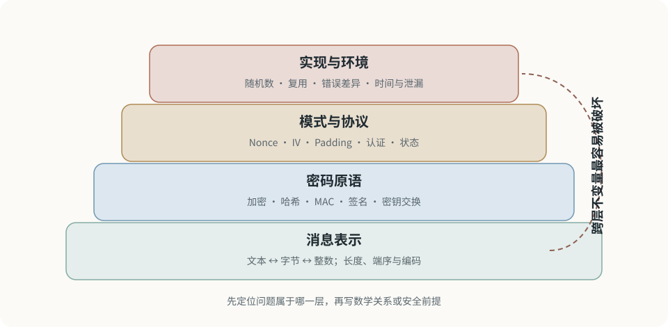

# 密码学知识地图

CTF 密码题通常不要求“击破正确使用的现代密码学”，而是发现经典密码结构、参数缺陷、随机数问题、协议组合错误或实现泄漏。

<figure class="ctf-figure ctf-figure--wide" id="fig-crypto-boundaries" data-asset="crypto-boundaries" markdown="1">
[{ loading="lazy" decoding="async" width="960" height="470" }](../assets/figures/original/crypto-boundaries.svg){ .ctf-figure__media }
<figcaption>算法名称只告诉你使用了哪种原语；题目线索往往来自表示、参数、协议状态和实现环境之间没有守住的不变量。</figcaption>
</figure>

## 先分四层

1. **消息表示**：文本如何变成字节与整数；
2. **密码原语**：加密、签名、哈希、MAC 或密钥交换；
3. **模式与协议**：原语如何组合，Nonce、IV、Padding 如何使用；
4. **实现与环境**：随机数、错误、时间、复用和边信道。

不要看到 RSA、AES 或 SHA 名称就默认问题一定在算法内部。

## 数学基础

### 模运算

$$
a\equiv b\pmod n \iff n\mid(a-b)
$$

需要掌握：

- 最大公约数与扩展欧几里得；
- 模逆元；
- 快速模幂；
- 中国剩余定理；
- 素数与因数分解；
- 有限域基础。

Python 的 `pow(a, e, m)` 可以高效计算 $a^e\bmod m$。

### 概率

理解：

- 均匀随机与伪随机；
- Birthday bound；
- 独立性与条件概率；
- 熵与密钥空间；
- 随机数复用的后果。

## 编码不是密码

Hex、Base64、URL 编码和字符替换不提供保密性。先确定转换是否可逆、是否依赖秘密，再讨论它属于编码、压缩、混淆还是加密。

基础见[字节、编码与端序](../fundamentals/bytes-encoding.md)。

## 经典密码

用于训练统计与结构识别：

- Caesar / Affine；
- Vigenère；
- Transposition；
- 单表替换；
- XOR 与重复密钥；
- Hill cipher。

分析信号包括字符集、频率、周期、已知明文和语言结构。经典密码的教学分析不应被误写成现代加密的通用攻击。

## 对称密码

区分：

- Block cipher 与 Stream cipher；
- ECB、CBC、CTR、GCM 等模式；
- Key、IV、Nonce；
- Padding；
- 保密性与完整性。

重点不变量：

- Nonce/IV 的唯一性或不可预测性要求；
- 流密码/CTR 密钥流不能复用；
- 未认证加密可能被篡改；
- Padding 错误与其他错误不应形成可区分侧信道；
- GCM 等 AEAD 同时验证关联数据和密文。

## 非对称密码

### RSA

基础关系：

$$
n=pq,\qquad \varphi(n)=(p-1)(q-1),\qquad ed\equiv1\pmod{\varphi(n)}
$$

题目常见问题来自：

- 过小或相关素数；
- 指数与消息条件；
- 参数复用；
- 缺少安全填充；
- 泄漏部分私钥信息；
- 错误实现 CRT。

正确使用标准填充和足够参数的 RSA 不应靠简单代数“直接解密”。

### 椭圆曲线

核心是有限域上的群运算和离散对数假设。CTF 中常见的是曲线/点验证、Nonce 复用、参数或实现问题。

## 哈希、MAC 与签名

- Hash：固定长度摘要，不使用秘密；
- MAC：共享秘密下的完整性与认证；
- Signature：私钥签名、公钥验证；
- Password hashing：面向低熵口令的专用慢函数与 Salt。

Hash 相等、MAC 有效、签名有效分别证明的事情不同。签名验证成功也不自动证明消息符合业务授权。

## 解题流程

1. 保存全部参数与原始字节；
2. 明确消息、密文、密钥材料和随机数；
3. 写出数学关系与安全前提；
4. 检查长度、范围、重复和最大公约数；
5. 用小规模示例验证公式；
6. 编写脚本并加入断言；
7. 用格式、语义和校验交叉验证结果；
8. 说明问题在原语、协议还是实现层。

## 工具与练习

- [CryptoHack](https://cryptohack.org/)：分主题交互式密码挑战；
- [SageMath](https://www.sagemath.org/)：代数与数论计算；
- Python：大整数、字节和快速原型；
- [CyberChef](https://gchq.github.io/CyberChef/)：可视化转换，关键步骤仍应可脚本复现。

## 常见错误

- 把 Base64 当加密；
- 先转整数时丢失前导零；
- 混用大小端；
- 未确认模逆元存在；
- 对模数、群阶和欧拉函数混淆；
- 只因输出可打印就认为解密成功；
- 把碰撞、原像和第二原像混为一谈；
- 用浮点数处理大整数；
- 依赖在线工具却没有记录精确转换链。

## Reference

- [NIST FIPS 197 · Advanced Encryption Standard](https://csrc.nist.gov/pubs/fips/197/final)：AES 原语规范。
- [NIST SP 800-38A · Block Cipher Modes](https://csrc.nist.gov/pubs/sp/800/38/a/final)：ECB、CBC、CFB、OFB 与 CTR。
- [RFC 8017 · PKCS #1](https://www.rfc-editor.org/rfc/rfc8017)：RSA 加密、签名与标准编码方案。
- [RFC 8439 · ChaCha20 and Poly1305](https://www.rfc-editor.org/rfc/rfc8439)：流加密与认证组合的完整实例。
- [RFC 2104 · HMAC](https://www.rfc-editor.org/rfc/rfc2104)：基于哈希的消息认证码。
