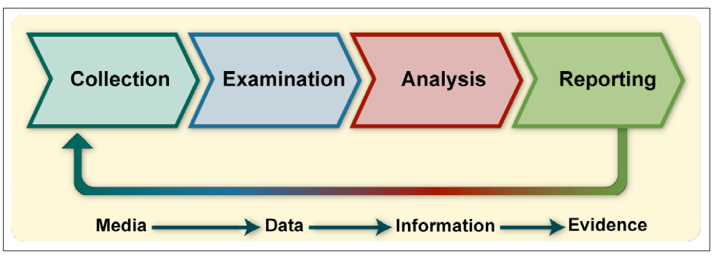

# 数字取证知识地图

数字取证从原始数据重建“发生了什么、何时发生、证据有多强”。CTF 取证同样需要保全原始附件、区分事实与推断，并用多个数据源交叉验证。

## 证据层次

<figure class="ctf-figure ctf-figure--wide" id="fig-nist-forensic-process" data-asset="nist-forensic-process" data-source="nist-sp-800-86" markdown="1">
[{ loading="lazy" decoding="async" width="1180" height="430" }](https://nvlpubs.nist.gov/nistpubs/legacy/sp/nistspecialpublication800-86.pdf#page=25){ .ctf-figure__media }
<figcaption>NIST SP 800-86，Figure 3-1（PDF 第 25 页，印刷页码 3-1）的精确裁剪。<a href="https://nvlpubs.nist.gov/nistpubs/legacy/sp/nistspecialpublication800-86.pdf#page=25">查看原页</a>；Republished courtesy of the National Institute of Standards and Technology，<a href="https://www.nist.gov/open/copyright-fair-use-and-licensing-statements-srd-data-software-and-technical-series-publications">复用声明</a>。</figcaption>
</figure>

解析工具的输出是对原始证据的一种解释。关键结论应能追溯到文件偏移、数据包、内存地址或日志记录。

## 文件分析

第一轮：

- SHA-256、大小和时间；
- 魔数与扩展名是否一致；
- 元数据；
- 文件尾和嵌套内容；
- 可打印字符串；
- 压缩、加密或高熵区域；
- 删除、截断或损坏迹象。

文件雕刻依赖签名和结构恢复，但签名命中不等于文件完整。

## 磁盘与文件系统

理解：

- 分区、卷和文件系统；
- inode/MFT 等元数据；
- 已分配与未分配空间；
- 删除语义；
- 日志与快照；
- 文件名、内容与时间戳的独立来源。

挂载未知镜像时优先只读。分析工具的自动时间线需要核对时区和时间字段语义。

## 内存取证

内存镜像可能包含：

- 进程与线程；
- 映射、模块和句柄；
- 网络连接；
- 命令历史；
- 缓存的明文与密钥材料；
- 注入或异常执行痕迹。

采集时刻决定能看到什么。进程已退出、页面被换出或内核版本不匹配都会影响结果。

[Volatility 3](https://volatility3.readthedocs.io/) 是常用内存取证框架。

## 网络取证

先做会话和时间线，而不是立即跟随某个字符串：

- 端点、端口和协议；
- DNS 请求与解析；
- TCP 重传、乱序和会话重组；
- HTTP/TLS 等应用协议；
- 文件传输与对象导出；
- 周期、突发、大小和方向；
- 抓包点带来的可见性边界。

工具：[Wireshark](https://www.wireshark.org/)、`tshark`、`tcpdump`。

!!! note "没有看到不等于没有发生"

    抓包可能缺失、位于错误位置、只覆盖单向流量，或内容已加密。负面结论必须说明采集范围。

## 日志与时间线

每条事件至少记录：

- 时间值与时区；
- 数据源；
- 主体与对象；
- 动作；
- 原始记录位置；
- 解析规则；
- 置信度。

常见时间问题：

- UTC 与本地时间混用；
- 秒、毫秒、微秒单位混淆；
- 系统时钟漂移；
- 创建、修改、访问、元数据变化语义不同；
- 日志延迟写入或批处理。

## 隐写与媒体

先区分：

- 元数据藏信息；
- 文件尾附加或容器嵌套；
- 像素/采样值中的低位修改；
- 调色板、Alpha、频域或帧间关系；
- 文本中的空白、Unicode 或排版通道。

不要一上来穷举所有工具。先观察格式结构、统计分布和题面线索，再选择针对实验。

## 取证流程

1. 保存原始附件并计算哈希；
2. 记录来源、时间和工具版本；
3. 建立只读基线；
4. 按文件、会话、进程或事件分类；
5. 构建统一时间线；
6. 提出可证伪假设；
7. 回到原始证据验证；
8. 说明缺失、冲突和不确定性；
9. 只发布规则允许的脱敏材料。

## 练习方向

- 文件头与文件雕刻；
- PCAP 会话恢复；
- 磁盘镜像与删除文件；
- 浏览器和应用痕迹；
- 内存进程与连接；
- 日志关联和时间线；
- 图片、音频与容器隐写。

## Reference

- [NIST SP 800-86 · Guide to Integrating Forensic Techniques into Incident Response](https://doi.org/10.6028/NIST.SP.800-86)：文件、操作系统、网络和应用数据的取证流程。
- [RFC 3227 · Guidelines for Evidence Collection and Archiving](https://www.rfc-editor.org/rfc/rfc3227)：证据采集顺序、完整性与归档。
- [Volatility 3 Documentation](https://volatility3.readthedocs.io/)：内存镜像分析框架。
- [Wireshark User’s Guide](https://www.wireshark.org/docs/wsug_html_chunked/)：网络采集与协议分析。
- [The Sleuth Kit Documentation](https://sleuthkit.org/sleuthkit/docs/)：磁盘镜像与文件系统分析接口。
