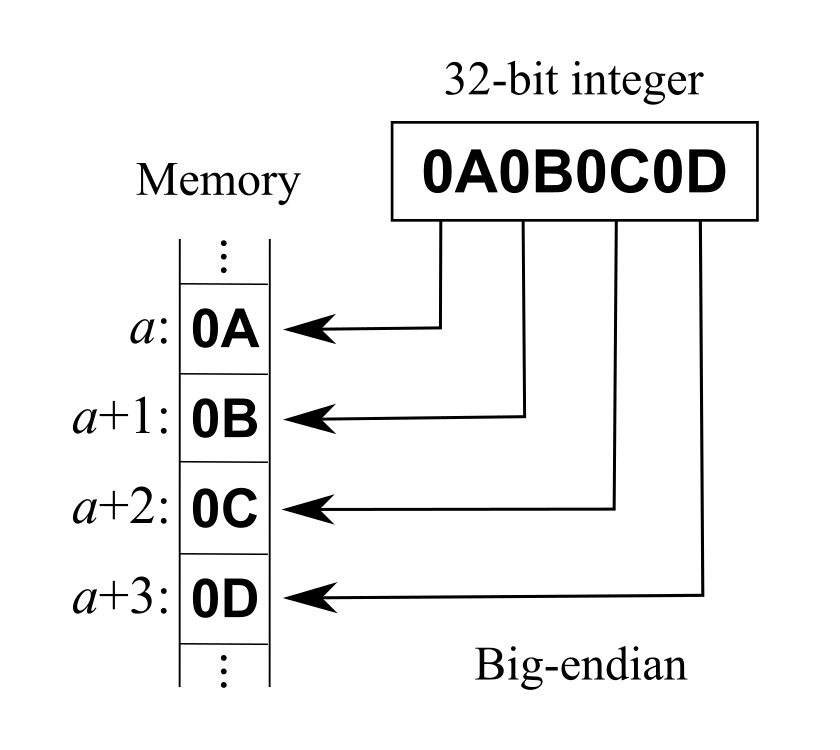

---
tags:
  - 字节
  - 编码
  - 端序
  - Python
---

# 字节、编码与端序

许多 CTF 卡点并不来自复杂漏洞，而来自把不同层的对象混在一起：

- 字符串 `"41"` 是两个字符；
- 十六进制文本 `41` 可表示一个字节 `0x41`；
- 这个字节按 ASCII 解码是字符 `A`；
- 同一字节也可以被解释为整数 $65$。

正确问题不是“这串东西是什么”，而是：

> 当前层把哪些字节，按什么规则，解释成什么对象？

## 1. 位、字节与进制

一个 bit 只能是 0 或 1；一个 byte 通常是 8 bit，可表示 $2^8=256$ 种模式。十六进制一位对应 4 bit，因此两个十六进制数字恰好表示一个字节：

```text
二进制    0100 0001
十六进制  4    1
无符号整数 65
ASCII     A
```

进制只是整数的书写方式：

$$
0b1010 = 0o12 = 10 = 0xA
$$

Python 可以明确完成转换：

```python
def main() -> None:
    text = "414243"
    raw = bytes.fromhex(text)
    value = int.from_bytes(raw, "big")
    print(raw)
    print(raw.decode("ascii"))
    print(value)
    print(value.to_bytes(3, "big").hex())

if __name__ == "__main__":
    main()
```

输出中的 `b"ABC"` 是 Python 对字节串的表示，不等于普通文本字符串。

## 2. `str` 与 `bytes`

在 Python 3 中：

- `str` 是 Unicode 文本；
- `bytes` 是 0–255 的字节序列；
- `encode`：文本 $\to$ 字节；
- `decode`：字节 $\to$ 文本。

```python
def main() -> None:
    text = "安全"
    raw = text.encode("utf-8")
    print(text, len(text))
    print(raw, len(raw), raw.hex())
    print(raw.decode("utf-8"))

if __name__ == "__main__":
    main()
```

`len(text)` 是 Unicode 码点数量，`len(raw)` 是 UTF-8 字节数。网络、文件和密码学原语最终处理的通常是字节，不是抽象字符。

!!! warning "不要随意忽略解码错误"

    `errors="ignore"` 会静默丢字节，可能破坏证据。分析未知数据时先保留原始字节和十六进制，再决定使用哪种编码。

## 3. ASCII、Unicode 与 UTF-8

### ASCII

ASCII 定义 0–127 的字符映射。例如：

- `0x30`–`0x39` 是字符 `0`–`9`；
- `0x41`–`0x5A` 是 `A`–`Z`；
- `0x61`–`0x7A` 是 `a`–`z`；
- `0x0A` 是换行 LF。

### Unicode

Unicode 为字符分配码点，例如 `A` 是 `U+0041`。码点仍不是文件中的具体字节。

### UTF-8

UTF-8 把码点编码成 1–4 个字节：

- ASCII 范围保持单字节兼容；
- 其他字符使用多字节前缀；
- 同一视觉字符可能有不同 Unicode 组合形式。

字符串比较、长度限制、正则和规范化相关题目中，要明确比较发生在字节、码点还是规范化后的字符层。

## 4. Hex 与 Base64 是表示，不是加密

### Hex

Hex 用两个可打印字符表示一个字节，因此大小通常翻倍。它保留信息，可以无损还原。

### Base64

Base64 每 3 字节转换成 4 个字符，常见字母表由大小写字母、数字、`+`、`/` 组成，`=` 用于填充。URL-safe 变体把 `+`、`/` 换成 `-`、`_`。

```python
from base64 import b64decode, b64encode

def main() -> None:
    raw = b"CTF: bytes first"
    encoded = b64encode(raw)
    decoded = b64decode(encoded, validate=True)
    print(encoded.decode("ascii"))
    print(decoded)
    assert decoded == raw

if __name__ == "__main__":
    main()
```

`validate=True` 能拒绝部分非法字符。仅凭字符集“像 Base64”不能证明它一定是 Base64；解码后还要检查长度、魔数、结构和语义。

!!! note "编码、压缩、加密"

    - 编码解决表示与兼容；
    - 压缩利用冗余减少体积；
    - 加密依赖密钥隐藏信息；
    - 哈希把任意输入映射到固定长度摘要，通常不可逆。

## 5. 端序

端序决定多字节整数在内存或协议中的排列。

整数 $0x12345678$：

```text
大端（big-endian）    12 34 56 78
小端（little-endian） 78 56 34 12
```

<figure class="ctf-figure ctf-figure--portrait" id="fig-big-endian" data-asset="big-endian" data-source="wikimedia-big-endian" markdown="1">
[{ loading="lazy" decoding="async" width="840" height="750" }](https://commons.wikimedia.org/w/index.php?title=File:Big-Endian.svg&oldid=823465610){ .ctf-figure__media }
<figcaption>图中地址从 <code>a</code> 递增到 <code>a+3</code>，高有效字节 <code>0A</code> 位于最低地址，这正是大端布局；换成小端时四个字节的地址顺序反转，而整数值本身不变。图源：R. S. Shaw，<a href="https://commons.wikimedia.org/w/index.php?title=File:Big-Endian.svg&oldid=823465610">Wikimedia Commons 固定修订</a>，作者已作 <a href="https://commons.wikimedia.org/wiki/File:Big-Endian.svg#Licensing">Public Domain dedication</a>。</figcaption>
</figure>

端序只对多字节对象有意义；单个字节没有端序。网络协议常用大端，因此也称 network byte order；x86/x86-64 内存通常是小端。

Python `struct` 能明确指定布局：

```python
from struct import pack, unpack

def main() -> None:
    value = 0x12345678
    little = pack("<I", value)
    big = pack(">I", value)
    print(little.hex(), big.hex())
    assert unpack("<I", little)[0] == value
    assert unpack(">I", big)[0] == value

if __name__ == "__main__":
    main()
```

- `<`：小端；
- `>`：大端；
- `I`：无符号 32 位整数；
- `Q`：无符号 64 位整数。

不要用本机默认布局解析文件或协议；显式写出端序、宽度和符号。

## 6. 有符号数与补码

同一组位可以按有符号或无符号解释。对 $n$ 位补码：

- 最高位为 0 时，值与无符号相同；
- 最高位为 1 时，有符号值为 $u-2^n$，其中 $u$ 是无符号值。

例如 `0xff`：

- 无符号 8 位：$255$；
- 有符号 8 位：$255-256=-1$。

范围：

$$
\text{unsigned }n\text{-bit}: [0,2^n-1]
$$

$$
\text{signed }n\text{-bit}: [-2^{n-1},2^{n-1}-1]
$$

长度检查、整数截断和边界比较题中，必须追踪每一步的位宽和符号转换。

## 7. XOR

异或的基本性质：

$$
x\oplus 0=x,\qquad x\oplus x=0,\qquad
x\oplus y\oplus y=x
$$

对同一密钥流做两次 XOR 可恢复原文：

```python
def xor_repeat(data: bytes, key: bytes) -> bytes:
    if not key:
        raise ValueError("key must not be empty")
    return bytes(value ^ key[i % len(key)] for i, value in enumerate(data))

def main() -> None:
    message = b"known local sample"
    key = b"key"
    cipher = xor_repeat(message, key)
    assert xor_repeat(cipher, key) == message
    print(cipher.hex())

if __name__ == "__main__":
    main()
```

这段代码只说明 XOR 的可逆结构，不代表重复密钥 XOR 是安全加密。密钥重复会引入周期和统计关系。

## 8. 魔数、长度与结构

未知字节的第一轮问题：

1. 是否有已知魔数；
2. 长度是否暗示固定块或头部；
3. 是否存在可打印字符串；
4. 熵高是压缩、加密还是本身随机；
5. 文件尾是否有额外数据；
6. 多个长度/偏移字段是否自洽；
7. 解码后是否出现另一层容器。

常见魔数示例：

| 格式 | 十六进制开头 |
| --- | --- |
| PNG | `89 50 4e 47 0d 0a 1a 0a` |
| JPEG | `ff d8 ff` |
| ZIP | `50 4b 03 04` |
| ELF | `7f 45 4c 46` |
| PDF | `25 50 44 46` |

签名只说明开头符合格式特征。恶意或题目样本可以伪造、截断或嵌套格式。

## 9. 哈希用于完整性与定位

保存样本时记录 SHA-256：

```bash
shasum -a 256 ./sample.bin
```

哈希可以：

- 确认工作前后文件是否变化；
- 对照团队成员使用的是否同一附件；
- 给 Writeup 中的样本提供稳定标识。

哈希相同是非常强的同一性证据；哈希不同只说明至少一个字节不同，不告诉差异原因。

## 10. 一套稳定的转换流程

处理未知文本或字节时：

1. 保存原始输入，不覆盖；
2. 写下当前表示层；
3. 每次只做一次转换；
4. 记录输入输出长度；
5. 输出十六进制和可打印视图；
6. 检查格式、魔数或校验；
7. 若继续解码，保留每一层中间结果；
8. 用逆变换验证能否回到上一步。

## 常见错误

- 把 `"deadbeef"` 当作已经是 4 字节；
- 对未知字节直接 `.decode()`；
- 把 Base64 当作加密；
- 忽略 URL-safe Base64 或缺失填充；
- 用本机端序解析协议；
- 把无符号长度当有符号数；
- 在整数转换前后丢失前导零；
- 只根据扩展名或 `strings` 输出判断文件内容；
- 多层转换后没有保留中间证据。

## 迁移到各分类

- **Web**：URL 编码、Unicode 规范化、JSON 与多解析器差异；
- **Pwn**：地址打包、小端序、整数截断和结构体布局；
- **逆向**：常量、缓冲区、字符串表和自定义编码；
- **密码**：消息到整数的映射、填充、块和 XOR；
- **取证**：魔数、文件雕刻、编码日志和嵌套容器；
- **Misc**：多层编码、二维码、协议和自动化转换。

## Reference

- [The Unicode Standard](https://www.unicode.org/versions/latest/)：码点、编码形式和字符语义。
- [RFC 3629 · UTF-8](https://www.rfc-editor.org/rfc/rfc3629)：UTF-8 的字节结构与合法范围。
- [RFC 4648 · Base-N Encodings](https://www.rfc-editor.org/rfc/rfc4648)：Base16、Base32 与 Base64。
- [Python Documentation · Binary Sequence Types](https://docs.python.org/3/library/stdtypes.html#binary-sequence-types-bytes-bytearray-memoryview)：`bytes` 与 `bytearray`。
- [Python Documentation · struct](https://docs.python.org/3/library/struct.html)：字节序、位宽与二进制布局。
