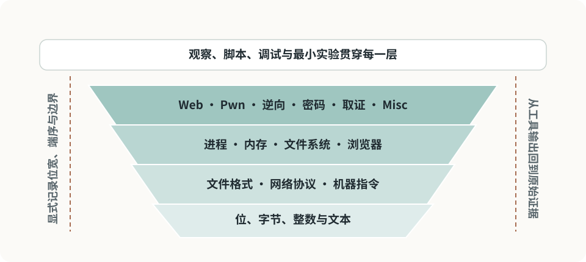

# 共同基础知识地图

CTF 分类不同，但底层反复出现同一组能力：把输入还原成字节、理解协议和文件格式、观察程序状态、写小脚本验证假设。

<figure class="ctf-figure ctf-figure--wide" id="fig-foundation-stack" data-asset="foundation-stack" markdown="1">
[{ loading="lazy" decoding="async" width="960" height="430" }](../assets/figures/original/foundation-stack.svg){ .ctf-figure__media }
<figcaption>越靠下的模型越容易跨题型复用；越靠上的分类越依赖具体组件、版本和题目约束。</figcaption>
</figure>

## 总览

| 模块 | 核心问题 | 常见分类 |
| --- | --- | --- |
| [字节与编码](bytes-encoding.md) | 看到的是文本、字节、整数还是容器？ | 全部 |
| Linux | 文件、权限、进程、信号和文件描述符如何工作？ | Pwn、逆向、取证、Misc |
| 网络 | 数据在哪一层传输，端点和状态在哪里？ | Web、取证、Misc |
| 文件格式 | 魔数、头部、长度、偏移和校验如何组织？ | 逆向、取证、Misc |
| C 与汇编 | 源码如何映射到内存、寄存器和控制流？ | Pwn、逆向 |
| Python | 如何快速转换、枚举、交互和验证？ | 全部 |
| 数学 | 整数、模运算、概率和代数结构是什么？ | 密码、算法、Pwn |
| 调试与实验 | 如何控制变量、记录状态并复现？ | 全部 |

## Linux

优先掌握以下模型，而不只是命令：

- 路径与 inode 的区别；
- 用户、组、权限位和有效身份；
- 进程地址空间、环境变量与当前目录；
- 标准输入、输出、错误和文件描述符；
- 管道、重定向与退出码；
- 信号、子进程和资源限制；
- `/proc` 暴露的进程与内核视图。

一条 Shell 命令失败时，区分是路径、权限、引号、环境、退出码还是下游管道造成的。

## 网络

至少能画出：

```text
应用数据
  ↓ HTTP / DNS / 自定义协议
传输层
  ↓ TCP / UDP
网络层
  ↓ IP
链路层
```

并能回答：

- 谁发起连接，谁监听；
- 地址、端口和协议分别属于哪一层；
- TCP 字节流为何没有天然“消息边界”；
- DNS 名称与最终连接地址的关系；
- NAT、代理和负载均衡改变了哪个视角；
- 抓包位置决定能看到什么。

## 文件格式

不要根据扩展名判断内容。常见格式都可以从以下结构理解：

1. 魔数或签名；
2. 版本与标志；
3. 长度、偏移和条目数；
4. 数据区；
5. 索引、校验或尾部结构；
6. 嵌套的压缩、归档或编码层。

文件解析题经常利用“长度字段与真实数据不一致”“两个解析器容错不同”或“文件尾存在额外数据”。

## C、汇编与机器模型

学习顺序建议：

1. 整数宽度、符号和溢出；
2. 数组、指针、结构体和内存布局；
3. 栈、堆、静态存储和虚拟内存；
4. 指令、寄存器、标志位和寻址；
5. 调用约定、函数栈帧和返回值；
6. 编译、链接、装载和动态库；
7. 未定义行为与保护机制。

Pwn 和逆向真正共享的是同一套机器模型，只是观察方向不同。

## Python

CTF 中最常用的部分：

- `bytes`、`bytearray`、`str`；
- `int.from_bytes` 与 `int.to_bytes`；
- `struct`、`base64`、`binascii`、`hashlib`；
- 正则、JSON、压缩包与文件流；
- 大整数、模幂 `pow(a, e, m)`；
- `socket` 或专用交互库；
- 小规模枚举与对拍。

脚本要保留输入、输出、错误和判定条件；不要让一次偶然的远程响应成为唯一成功标准。

## 调试与实验

统一使用[解题方法](../guide/methodology.md)：

- 先观察，后修改；
- 原始证据与工作副本分开；
- 每个实验只验证一个假设；
- 设置超时与资源上限；
- 记录工具版本和完整命令；
- 用独立证据交叉验证。

## 推荐掌握顺序

1. [字节、编码与端序](bytes-encoding.md)；
2. Linux 文件、进程和 Shell；
3. TCP/IP 与 HTTP；
4. Python 数据处理；
5. C 内存与基础汇编；
6. 文件格式、调试与抓包；
7. 根据主方向补数学、编译或浏览器模型。

## Reference

- [RFC 1122 · Requirements for Internet Hosts — Communication Layers](https://www.rfc-editor.org/rfc/rfc1122)：互联网主机的通信分层与协议要求。
- [Linux man-pages](https://man7.org/linux/man-pages/)：Linux 系统调用、文件、进程和网络接口。
- [System V Application Binary Interface](https://refspecs.linuxfoundation.org/elf/abi386-4.pdf)：目标文件、装载与进程接口的基础规范。
- [Python Standard Library](https://docs.python.org/3/library/)：字节、结构化数据、网络、压缩和哈希模块。
