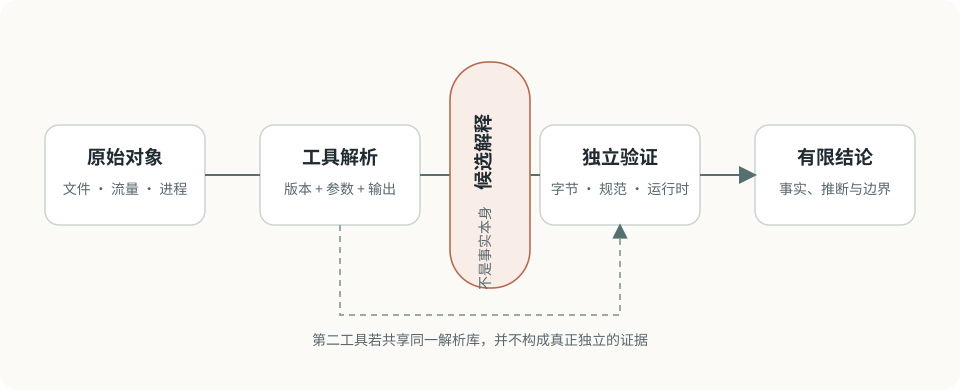

# 工具与工作台

工具箱应围绕可复现流程组织，而不是按“安装过什么”堆积。每个工具都要知道输入、输出、修改行为、版本和可能的误判。

<figure class="ctf-figure ctf-figure--wide" id="fig-evidence-pipeline" data-asset="evidence-pipeline" markdown="1">
[{ loading="lazy" decoding="async" width="960" height="390" }](../assets/figures/original/evidence-pipeline.svg){ .ctf-figure__media }
<figcaption>工具把字节转换成更易观察的表示；关键结论仍要回到规范、原始数据或运行时行为验证。</figcaption>
</figure>

## 基础工作台

| 层次 | 常用工具 | 主要用途 |
| --- | --- | --- |
| 文件观察 | `file`、`stat`、`xxd`、`strings`、`binwalk` | 类型、元数据、十六进制、嵌套内容 |
| 文本与数据 | `grep`、`sed`、`awk`、`jq`、Python | 筛选、转换、结构化处理 |
| 网络 | `curl`、Wireshark、`tcpdump` | HTTP、抓包、协议与时间线 |
| Web | 浏览器开发者工具、Burp Suite | 请求重放、状态与数据流 |
| 二进制 | GDB、pwndbg、Ghidra、radare2 | 调试、反汇编、反编译 |
| Pwn 脚本 | pwntools | 本地/远程交互、ELF、打包与日志 |
| 密码与数学 | Python、SageMath、CyberChef | 大整数、代数、格式转换 |
| 隔离 | Docker、虚拟机、快照 | 依赖固定和风险隔离 |

## 目录约定

```text
challenge-name/
├── original/     # 原始题面与附件，只读保存
├── work/         # 解包、修补和实验副本
├── scripts/      # 可复现自动化
├── captures/     # 授权环境中的流量和交互记录
├── notes/        # 观察、假设、失败路径
└── README.md     # 最终复现入口
```

公共仓库只保留规则允许公开、已经脱敏且确有复现价值的内容。

## Python 环境

每个题目或专题尽量固定依赖：

```bash
python3 -m venv .venv
source .venv/bin/activate
python -m pip install --upgrade pip
python -m pip freeze > requirements.txt
```

`pip freeze` 记录的是完整当前环境，可能包含无关包。更长期的项目可维护直接依赖文件，再生成锁定结果。

## Web 工作台

### 浏览器开发者工具

适合观察 DOM、网络请求、存储、Cookie、来源映射和前端状态。浏览器展示的是客户端视角，不能直接证明服务端实现。

### Burp Suite

适合在授权环境中拦截、重放和比较 HTTP 消息。保存项目文件前检查是否包含会话 Cookie、账号信息或题目 Flag。

### `curl`

用明确的请求构造最小复现：

```bash
curl --silent --show-error \
  --request GET \
  --header 'Accept: application/json' \
  'http://127.0.0.1:8080/health'
```

命令中使用本地占位地址。真实题目需要遵守速率、范围和认证规则。

## 二进制工作台

先确认：

```bash
file ./challenge
shasum -a 256 ./challenge
```

再观察架构、动态链接、符号和保护机制。动态调试应在隔离环境中进行，未知样本不要直接放开网络。

常用工具：

- [GDB](https://sourceware.org/gdb/)：调试器；
- [pwndbg](https://pwndbg.re/)：面向二进制分析的 GDB/LLDB 扩展；
- [Ghidra](https://ghidra-sre.org/)：静态分析与反编译；
- [pwntools](https://docs.pwntools.com/)：CTF 二进制交互与脚本库。

## 网络与取证工作台

[Wireshark](https://www.wireshark.org/) 适合协议解码与会话分析；`tcpdump` 适合采集和快速筛选。原始 PCAP 应保留只读副本，分析时记录显示过滤器和导出步骤。

时间线分析先统一：

- 时区；
- 时间单位；
- 系统时钟偏差；
- 采集时间和事件时间；
- 文件系统时间语义。

## 工具输出的证据等级

| 输出 | 更准确的表述 |
| --- | --- |
| `file` 识别类型 | 文件头符合某类签名 |
| 反编译器生成 C | 工具对机器码的一种高层恢复 |
| 扫描器报告漏洞 | 存在需要人工验证的候选 |
| 熵较高 | 可能压缩、加密或本身近似随机 |
| 字符串出现域名 | 样本包含该字节序列，不证明实际连接 |

工具版本变化会改变识别和反编译结果。关键结论要回到原始字节、协议或运行时行为验证。

## Reference

- [Python Documentation · venv](https://docs.python.org/3/library/venv.html)：隔离 Python 环境。
- [Wireshark User’s Guide](https://www.wireshark.org/docs/wsug_html_chunked/)：采集、显示过滤与协议分析。
- [GDB Documentation](https://sourceware.org/gdb/documentation/)：调试器手册。
- [Ghidra Documentation](https://ghidra-sre.org/)：静态分析平台与官方文档入口。
- [pwntools Documentation](https://docs.pwntools.com/)：二进制交互、封装与日志接口。
