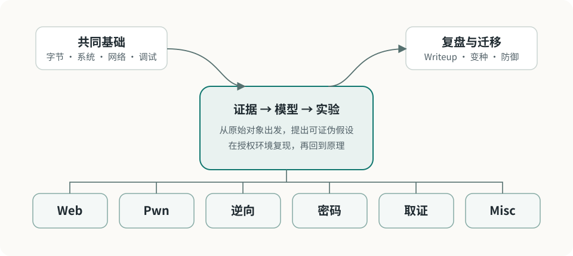

# CTF

CTF 与安全知识库。仅用于赛事、靶场和授权研究。

<figure class="ctf-figure ctf-figure--wide" id="fig-ctf-domain-map" data-asset="ctf-domain-map" markdown="1">
[{ loading="eager" decoding="async" width="960" height="430" }](assets/figures/original/ctf-domain-map.svg){ .ctf-figure__media }
<figcaption>知识库以共同基础和证据驱动方法为中心；分类是进入问题的路径，复盘负责把一次解法连接成可迁移知识。</figcaption>
</figure>

## 快速开始

- [学习路线](guide/roadmap.md)
- [解题方法](guide/methodology.md)
- [合法边界与实验安全](guide/lab-safety.md)
- [工具与工作台](guide/tooling.md)
- [Writeup 索引](writeups/index.md)

## 分类

- [共同基础](fundamentals/index.md)
- [Web 安全](web/index.md)
- [Pwn](pwn/index.md)
- [逆向工程](reverse/index.md)
- [密码学](crypto/index.md)
- [数字取证](forensics/index.md)
- [Misc](misc/index.md)

## 其他

- [资源](resources.md)
- [更新日志](changelog.md)
