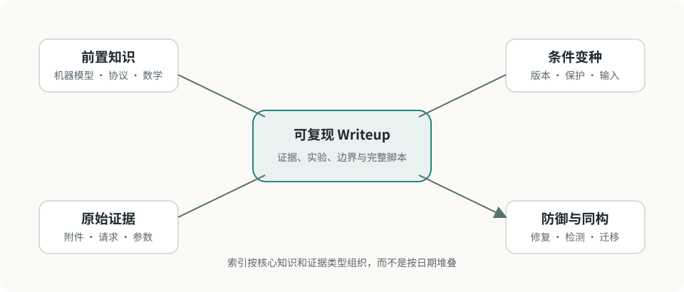

# Writeup 索引

Writeup 按核心知识和证据类型组织，而不是只按比赛日期排列。一道题可以关联多个分类，但应有一个主入口和明确的前置知识。

<figure class="ctf-figure ctf-figure--wide" id="fig-writeup-graph" data-asset="writeup-graph" markdown="1">
[{ loading="lazy" decoding="async" width="960" height="410" }](../assets/figures/original/writeup-graph.svg){ .ctf-figure__media }
<figcaption>题目名称负责定位实例，知识关系负责让一次解法在新版本、新保护或新协议中继续有用。</figcaption>
</figure>

## 当前内容

知识库刚建立，首批内容以可复用基础和分析框架为主：

| 内容 | 类型 | 关键能力 |
| --- | --- | --- |
| [解题方法：从现象到可复现结论](../guide/methodology.md) | 方法 | 证据、假设、最小实验、交叉验证 |
| [合法边界与实验安全](../guide/lab-safety.md) | 方法 | 范围、隔离、凭据与发布检查 |
| [字节、编码与端序](../fundamentals/bytes-encoding.md) | 基础专题 | 文本/字节、Base64、端序、补码、XOR |

具体赛事 Writeup 会在赛事允许公开、附件可合法再分发并完成脱敏后进入索引。

## 组织维度

### 按分类

- [Web](../web/index.md)
- [Pwn](../pwn/index.md)
- [逆向](../reverse/index.md)
- [密码](../crypto/index.md)
- [取证](../forensics/index.md)
- [Misc](../misc/index.md)

### 按证据类型

- 源代码或配置；
- 可执行文件；
- 网络服务与 HTTP；
- PCAP、磁盘或内存镜像；
- 密文与数学参数；
- 图片、音频和其他媒体。

### 按知识关系

每篇 Writeup 应连接：

- **前置知识**：理解题目所需的模型；
- **关键观察**：真正缩小搜索空间的证据；
- **同构问题**：系统边界不同但原理相同；
- **条件变种**：保护、版本或约束变化后哪里失效；
- **防御视角**：如何修复、检测或避免。

## 阅读方式

1. 先只看题面、样本摘要和环境；
2. 写下自己的第一轮观察；
3. 对照关键假设，而不是直接复制最终脚本；
4. 在独立授权环境重新复现；
5. 回答保护或输入变化后的影响；
6. 把新结论连接回专题页。

新增内容参考 [Writeup 写作模板](template.md)。
